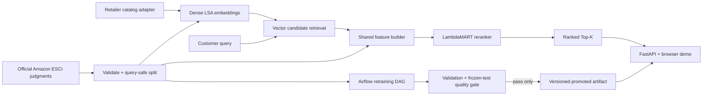

# Retail Search & Ranking System

A production-style, retailer-neutral search engine with an Amazon ESCI proof adapter. Stage 1 uses dense text embeddings to retrieve candidates; Stage 2 applies a LightGBM LambdaMART model built from semantic, lexical, metadata, and length features. Promoted artifacts are served by FastAPI and retrained through an Airflow quality-gated workflow.

> Benchmark claims are generated, never assumed. `artifacts/benchmark.json`, `FINAL_RESULTS.md`, and the demo result card are written/read from the same frozen-test measurement. If the measured relative NDCG@10 gain is below 11%, promotion and acceptance fail.

The completed frozen-test run measured NDCG@10 **0.739009 → 0.821654**, an **11.1832% relative improvement**, over 8,956 test queries and 181,701 judgments. The evidence-backed, frozen model version is `esci-us-20260901T100019Z-b041ca46`.

## Architecture



The core package exposes explicit `CatalogAdapter`, `CandidateRetriever`, `FeatureBuilder`, `Reranker`, `Evaluator`, and `SearchService` boundaries. Amazon-specific fields and ESCI labels stay in `retail_search.adapters.amazon_esci`, so another retailer can connect without rewriting retrieval, ranking, evaluation, or serving code.

## Dataset and evaluation integrity

The benchmark uses the official [Amazon Science Shopping Queries Dataset repository](https://github.com/amazon-science/esci-data), licensed Apache-2.0. It filters the US locale to Task 1's reduced ranking set (`small_version == 1`) and verifies the actual row count from the downloaded parquet files. The source schema and Task-1 filtering follow the repository README.

- Amazon's official test queries remain the frozen test partition.
- Official training queries are deterministically hash-split into train and validation.
- A query ID can occur in exactly one partition.
- The dense baseline and reranker score the identical judged candidates. Unjudged open-corpus products are never labeled irrelevant.
- Primary gain mapping is E=3, S=2, C=1, I=0. Amazon's separate reference gain convention is also reported under a distinct metric name.
- Feature/model decisions use validation queries; the frozen test set is evaluated after selection.

The dense baseline is a documented Latent Semantic Analysis embedding model: TF-IDF word/bigram vectors projected into a normalized dense space with TruncatedSVD. It ranks solely by cosine similarity. The reranker uses the dense score plus BM25, token coverage/Jaccard, exact/phrase/prefix, brand/color/numeric, description, length, and a locally fine-tuned MiniLM-L4 cross-encoder signal. The cross-encoder starts from a pinned Apache-2.0 MS MARCO revision, is trained only on project training queries with the configured ESCI gain objective, and is exported as a bundled OpenVINO FP16 model.

## Clean setup and full benchmark

Python 3.11 is supported.

```bash
python -m venv .venv
# Linux/macOS: source .venv/bin/activate
# Windows: .venv\Scripts\activate
python -m pip install -e ".[dev,training]"
python scripts/tasks.py test
python scripts/tasks.py download
python scripts/tasks.py prepare
python scripts/train_cross_encoder.py
python scripts/tasks.py benchmark-full
python scripts/tasks.py acceptance
```

`download` retrieves both official parquet files directly from `amazon-science/esci-data` and records byte counts and SHA-256 hashes. The full benchmark deliberately remains separate from serving: it creates the split manifests, dense model, features, validation experiments/ablations, frozen-test result, demo catalog index, curated comparison queries, and checksummed model bundle.

Generated evidence:

- `FINAL_RESULTS.md` - human-readable benchmark and exact reproduction commands
- `artifacts/benchmark.json` and `.csv` - raw metrics, dataset/split/config identifiers, latency, and quality gate
- `artifacts/acceptance_report.json` - criterion-level PASS/FAIL evidence
- `experiments/experiment_log.md` - validation-only experiments and ablations
- `docs/DEMO_EVIDENCE.md` and `docs/demo/*.png` - real running-app evidence

## Run the API and demo

Large trained artifacts are intentionally excluded from Git. Restore the frozen promoted bundle from its checksum-verified GitHub release, then start the application:

```bash
python scripts/fetch_promoted_artifact.py
docker compose up --build
```

Open <http://localhost:8000>. The landing page provides three artifact-backed modes:

1. A side-by-side embedding baseline vs ML reranker comparison on at least ten frozen ESCI test queries.
2. Free-text two-stage search over the offline Amazon demo catalog (with no NDCG claim for unjudged results).
3. Dataset, model version, measured held-out score, and latency evidence.

Required endpoints:

```bash
curl http://localhost:8000/health
curl http://localhost:8000/model-info
curl -X POST http://localhost:8000/search \
  -H "content-type: application/json" \
  -d '{"query":"wireless gaming mouse","top_k":10}'
python scripts/tasks.py smoke
python scripts/tasks.py demo-test
```

`POST /search` returns ranked products, dense and learned scores, rank movement, retrieval/reranking/total timing, and model/index versions. Empty or whitespace-only queries, strings over 300 characters, and `top_k` outside 1-50 receive validation errors. Models and indexes load once during process startup.

## Airflow retraining and promotion

The monthly `retail_search_retraining` DAG is in `airflow/dags/retrain.py`:

```text
ingest_data -> validate_data -> build_splits -> build_embeddings_index
  -> build_features -> train_ranker -> evaluate_validation -> quality_gate
  -> register_or_publish_model -> smoke_test_serving_artifact
```

Tasks are idempotent where practical. Downloads resume from partial files, preparation rewrites deterministic outputs, split manifests are content-hashed, and only candidates meeting the configured 11% frozen-test gate can update `artifacts/promoted.json`.

```bash
python scripts/tasks.py airflow-smoke
docker compose --profile airflow build airflow
docker compose --profile airflow run --rm airflow airflow dags list
docker compose --profile airflow run --rm airflow python scripts/tasks.py airflow-smoke
docker compose --profile airflow up airflow
```

The Airflow UI is exposed on <http://localhost:8080>. The reduced lifecycle smoke uses a tiny synthetic dataset but executes the real data/split/index/features/LambdaMART/gate/publish/load sequence inside the Airflow image. It does not retrain or modify the frozen promoted model.

## Repository map

```text
configs/                       data, retrieval, ranking, and promotion settings
src/retail_search/adapters/    Amazon ESCI proof adapter
src/retail_search/data/        download, validation, normalization, frozen splits
src/retail_search/retrieval/   dense LSA embedding and exact local vector index
src/retail_search/ranking/     shared features, LambdaMART training and inference
src/retail_search/evaluation/  ranking metrics, benchmark, acceptance report
src/retail_search/artifacts/   checksummed versioning and promotion loader
src/retail_search/api/         FastAPI routes, service, and zero-friction browser UI
airflow/dags/                  automated retraining and promotion graph
tests/                         metrics, splits, features, retrieval, API, artifacts, pipeline
```

## Limitations and commercial extension

- ESCI candidate judgments are not exhaustive corpus labels. Benchmark NDCG is valid only on the supplied judged sets; free-text catalog search is a product demonstration, not a labeled evaluation.
- The exact NumPy vector index is deliberately simple and reproducible for a compact offline demo. A larger deployment should implement the same `CandidateRetriever` boundary with FAISS/HNSW or a managed vector service.
- LSA makes a CPU-friendly, auditable dense baseline. A production experiment could replace it with a multilingual bi-encoder, preserving the same leakage and candidate-universe contract.
- Offline NDCG improvement is not a conversion or revenue claim. A retailer deployment should add inventory and behavior signals only when real data exists, then measure CTR, add-to-cart, conversion, and revenue/search in an online A/B test.

See [architecture](docs/architecture.md), [evaluation contract](docs/evaluation.md), and [model card](docs/model_card.md) for implementation details.
