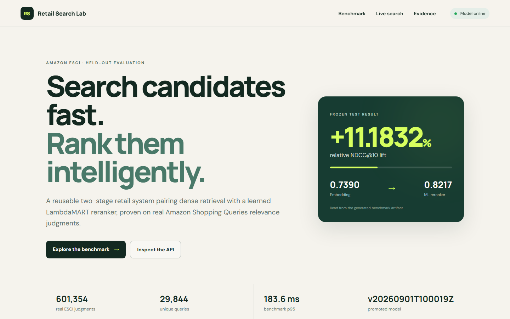
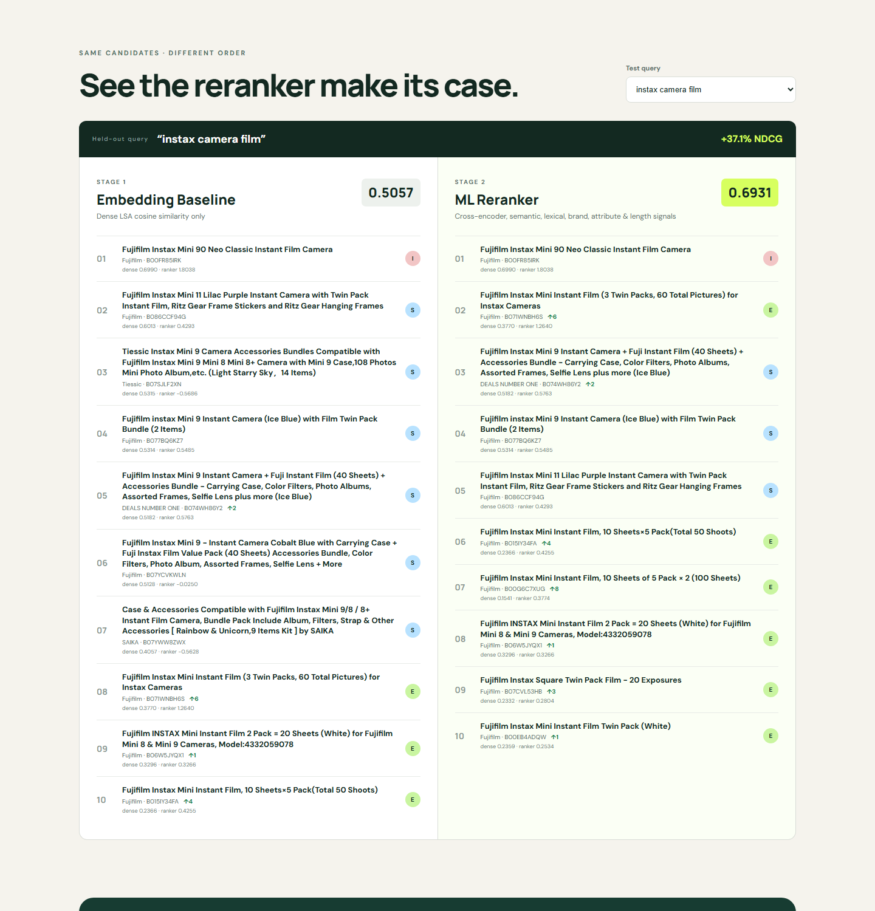
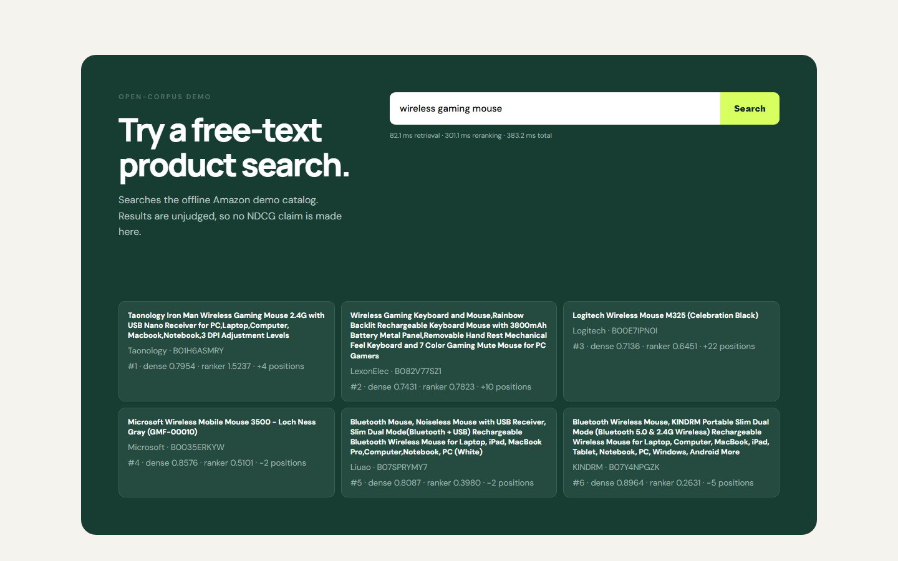

# Demo and verification evidence

Verified locally on 2026-09-01 (America/Toronto) against the promoted model `esci-us-20260901T100019Z-b041ca46`.

## Frozen-test evidence

The full benchmark processed 601,354 valid Amazon ESCI US Task-1 judgments across 29,844 queries. Amazon's official test partition remained frozen at 8,956 queries and 181,701 judgments.

| System | NDCG@10 | MRR@10 | p50 | p95 |
|---|---:|---:|---:|---:|
| Dense LSA embedding baseline | 0.739009 | 0.922760 | 14.43 ms | 15.84 ms |
| MiniLM feature + LambdaMART reranker | 0.821654 | 0.957245 | 164.41 ms | 183.55 ms |

Measured relative NDCG@10 improvement: **11.1832%**. Required minimum: **11.0%**. The benchmark, report, and UI read the result from `artifacts/benchmark.json`; the value is not a configured claim.

## Running-service verification

The API was started from the checksummed promoted bundle in the real Compose container with:

```powershell
wsl.exe -d retail-search-docker -- sh -lc "cd /mnt/b/Coding/Projects/retail-search && docker compose up --build -d api airflow"
.\.venv\Scripts\python.exe scripts\smoke_test.py
.\.venv\Scripts\python.exe scripts\demo_test.py
```

Observed results:

```text
PASS: /health, /model-info, and /search contracts validated
PASS: landing page and held-out benchmark comparison flow validated
```

The in-app browser then verified:

- artifact-backed 11.1832% summary and model version;
- all ten curated frozen-test queries are selectable;
- a query switch updates the side-by-side comparison;
- baseline and reranker lists show scores, ESCI labels, and rank movement;
- free-text search returns learned results with retrieval, reranking, and total latency;
- the page emits no browser console warnings or errors.

Screenshots from that running instance:







## Automated checks

```text
ruff check .                         PASS
pytest -q                            18 passed
scripts/tasks.py airflow-smoke       PASS: DAG graph + reduced end-to-end lifecycle
docker compose config --quiet        PASS
docker compose ps                    PASS: API and Airflow healthy
```

The Airflow graph smoke verifies the required lifecycle:

```text
ingest_data -> validate_data -> build_splits -> build_embeddings_index
  -> build_features -> train_ranker -> evaluate_validation -> quality_gate
  -> register_or_publish_model -> smoke_test_serving_artifact
```

The reduced lifecycle also ran inside the real Airflow 2.10.5 image. It executes a 36-row offline fixture through query-safe split validation, dense embeddings/index, feature generation, LambdaMART training, validation evaluation, no-regression quality gate, checksummed promotion, fresh artifact loading, and retrieval. It promoted `airflow-smoke-v1` inside a temporary directory and cleaned it after the test. The production DAG was discovered with zero import errors, the Airflow service health endpoint returned HTTP 200, and `python -m pip check` reported no broken requirements. The image removes the base image's unused Google and Snowflake provider packages because their pandas constraints conflict with the benchmark's pinned runtime; this DAG uses neither provider.

The full benchmark DAG was intentionally not triggered after promotion: it would retrain and potentially replace the model that the user directed this release to freeze. The reduced real-container lifecycle verifies every DAG stage without mutating the frozen promoted bundle.

## Docker host note

The installed Docker Desktop 4.53.0 application still crashes before opening its engine socket while initializing the stale optional inference-manager socket at `AppData/Local/Docker/run/dockerInference`. The signed Docker Desktop 4.89.0 installer was downloaded and verified, and that release documents a stuck-socket startup fix, but applying it requires an administrator-approved UAC action that this non-administrator task cannot perform. No factory reset, uninstall, image deletion, volume deletion, or UAC automation was attempted.

The runtime acceptance blocker was resolved independently with a dedicated WSL2 Alpine 3.24.1 environment running Docker Engine 29.5.3 and Docker Compose 5.1.4. In that real Docker environment, both images built successfully, the API and Airflow Compose services reached healthy state, FastAPI served the promoted model, the browser demo completed its interactive flows with zero console errors, Airflow discovered the DAG with zero import errors, and the reduced lifecycle passed end to end. This dedicated runtime does not alter the user's Docker Desktop installation or data.

## Clean-checkout verification

The exact staged Git index was exported to an ignored clean directory with `git checkout-index`. The release archive restored and verified all 13 promoted-model files (77,636,945 extracted bytes) against both the tracked bundle SHA-256 and the per-file model manifest. From that clean checkout, all 18 tests and Ruff passed, fresh API and Airflow images built, both Compose services reached healthy state, the API/demo/acceptance smokes passed, Airflow again reported zero DAG import errors, the reduced lifecycle passed, and the browser showed the exact 11.1832% result with populated comparison/search views and zero console errors.
